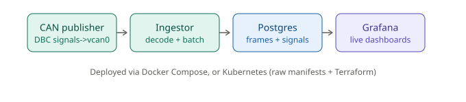

# TelemOps

A production-style CAN telemetry pipeline: simulated vehicle signals are encoded onto a virtual CAN bus, ingested and decoded in real time, persisted to Postgres, visualized live in Grafana, and deployed via both Docker Compose and Kubernetes (with Terraform-managed infrastructure).

Built as a hands-on portfolio project to demonstrate Cloud/Infra/Data engineering skills: containerization, data pipeline design, batching/load testing, dashboards and alerting, container orchestration, and Infrastructure as Code.

## Architecture

    can_publisher.py --[vcan0]--> ingest.py --[batched writes]--> Postgres --[live queries]--> Grafana
    (DBC-encoded signals)         (cantools decode + execute_values batching)   (can_frames + can_signals)

Note: `dbc/vehicle.dbc` and `ingestion/vehicle.dbc` are intentionally identical - Docker's build context for the ingestion image cannot reach outside its own directory, so a copy is kept alongside the Dockerfile.

Two deployment targets, same codebase:
- Docker Compose (docker-compose.yml) - local dev, single-host.
- Kubernetes (k8s/ for raw manifests, terraform/ for the same stack as Terraform-managed IaC) - via minikube, with hostNetwork pods for CAN-bus access and NodePort routing where cluster-internal DNS isn't reachable.

## Stages

| Stage | What it covers | Status |
|---|---|---|
| 1. Containerization Foundations | Dockerize a CAN node, Compose + Postgres, verify real data flow, multi-stage build | Complete |
| 2. Data Pipeline | Schema design, always-on ingestion service, batching, load testing to find the real throughput ceiling | Complete |
| 3. Dashboards | Grafana + Postgres, live time-series panels, a working threshold alert | Complete |
| 4. Orchestration | Kubernetes via minikube, hostNetwork/NodePort networking, PVC persistence | Complete |
| 5. Infrastructure as Code | Terraform-managed K8s stack, proven destroy/recreate reproducibility | Complete |
| 6. Packaging | This README, architecture diagram, final polish | Complete |

Full engineering log, including every bug found, root-caused, and fixed, is in DEVLOG.md. Measured performance numbers are in BENCHMARKS.md.

## Quick start (Docker Compose)

    git clone https://github.com/Asif-Ucchwas/telemops.git
    cd telemops
    ./setup_vcan.sh
    docker-compose up -d

Grafana: http://localhost:3000 (admin / telemops_admin)
Postgres: localhost:5432 (telemops / telemops_dev)

## Quick start (Kubernetes, via Terraform)

    minikube start --driver=docker --memory=2200 --cpus=2
    minikube ssh -- "sudo modprobe vcan && sudo ip link add dev vcan0 type vcan && sudo ip link set up vcan0"
    eval $(minikube docker-env)
    docker build -t telemops-postgres:latest ./postgres
    docker build -t telemops-ingestion:latest ./ingestion
    docker build -t telemops-grafana:latest ./grafana
    cd terraform
    terraform init
    terraform apply

Grafana (via port-forward, since minikube's node IP isn't reachable from outside WSL2):

    kubectl port-forward deploy/grafana 3001:3000

Then open http://localhost:3001.

## Notable engineering decisions

- Realistic signal encoding. Rather than publishing arbitrary counter bytes, the publisher encodes genuine DBC-defined signals (VehicleSpeed, EngineRPM, BatteryTemp) via cantools, so the whole pipeline operates on data that actually means something.
- Docker Hub CDN workaround. Several official images (postgres, grafana/grafana) reliably failed to pull on this network with consistent, diagnosed TLS handshake timeouts. Rather than keep fighting it, both were rebuilt from lightweight base images plus each project's own official APT repository.
- Two Kubernetes networking modes, on purpose. The publisher/ingestor need hostNetwork for raw CAN-bus access, trading away internal Service DNS, so they reach Postgres via a NodePort instead. Grafana, with no CAN-bus dependency, uses plain Service DNS.
- Proven, not assumed, persistence. PVC durability was tested by deliberately deleting a live Postgres pod and confirming a fresh pod, reattached to the same PVC, still had all prior data.
