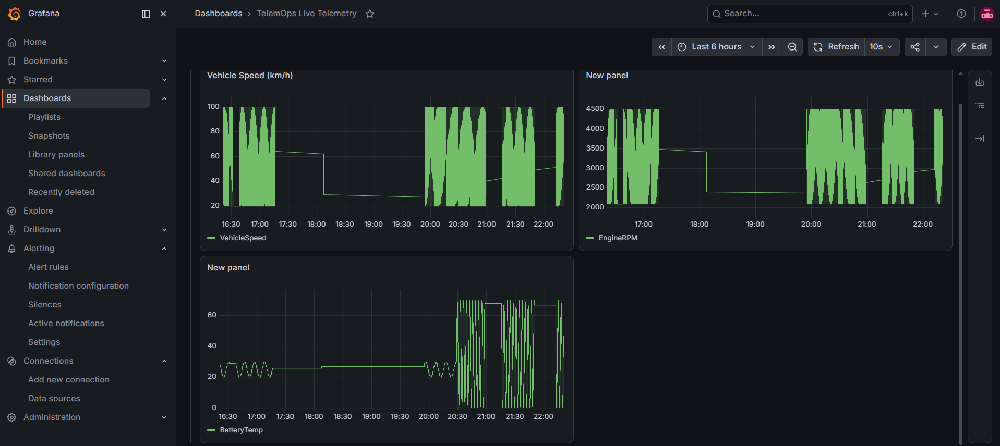
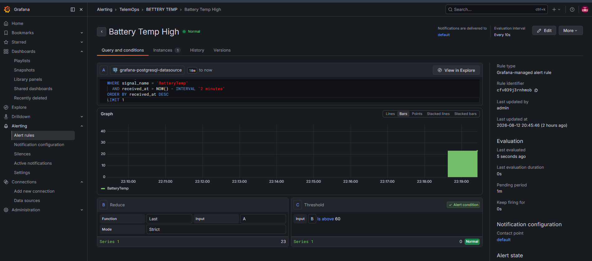

# TelemOps

**A reproducible container-to-cloud telemetry and monitoring pipeline for robotics systems — CAN bus signal simulation through to Kubernetes-orchestrated dashboards, built and verified end-to-end.**


Six stages, one coherent pipeline — not six disconnected demos. Every claim below (throughput ceiling, alert firing, PVC persistence, destroy/recreate reproducibility) was proven with a deliberate test, not just configured and assumed to work. Every real bug found along the way is documented, not hidden.

## Table of contents

- [Architecture](#architecture)
- [What's actually verified here](#whats-actually-verified-here)
- [Benchmark results](#benchmark-results)
- [Quick start](#quick-start)
- [Repository structure](#repository-structure)
- [Documentation](#documentation)
- [Honest scope notes](#honest-scope-notes)
- [Author](#author)

## Architecture

    can_publisher.py (DBC-encoded signals)
      |  VehicleSpeed, EngineRPM, BatteryTemp encoded via cantools
      v
    vcan0 (virtual SocketCAN interface)
      v
    ingest.py
      |  cantools decode + buffered, multi-row execute_values batching
      v
    Postgres
      |  can_frames (raw) + can_signals (decoded), indexed for time-series queries
      v
    Grafana
         Live time-series panels + threshold alerting

Deployed via two independent paths from the same codebase: Docker Compose for local single-host dev, and Kubernetes (minikube) with Terraform-managed infrastructure for orchestrated deployment. `hostNetwork` pods handle the CAN-bus-dependent services; a NodePort bridges them to Postgres since `hostNetwork` bypasses normal cluster DNS.

## What's actually verified here

| Component | Verification method | Result |
|---|---|---|
| Multi-stage Docker build | Before/after image size measurement | 219MB &rarr; 202MB (~8%), with an honest note on why the gain was modest |
| Ingestion batching under load | Load-tested 10Hz&rarr;20,000Hz against real Postgres | Zero frame loss up to ~5,195 frames/sec; a genuine ceiling found at ~9,700 frames/sec |
| Throughput ceiling root cause | Independent bus-level measurement (`candump -c`) run alongside the load test | Confirmed every frame reached `vcan0`; loss isolated to the ingestor's single-threaded `recv()` loop, not Postgres |
| Grafana alert firing | Live threshold-crossing observed directly in the UI | Confirmed genuine Normal &harr; Firing transitions against real data |
| PersistentVolumeClaim durability | Deliberately deleted a live Postgres pod mid-session | Replacement pod, reattached to the same PVC, retained all 14,237 prior rows |
| Terraform destroy/recreate | Full 8-resource stack destroyed and rebuilt from `.tf` files alone | Clean `apply`, zero manual intervention, after a real `chmod` permissions bug was found and fixed |
| hostNetwork vs. Service DNS | Contrasted the publisher/ingestor (hostNetwork + NodePort) against Grafana (plain Service DNS) | Both networking modes verified working via their respective, correct paths |

The full debugging history — every bug found, how it was diagnosed, and how it was fixed — is in [`DEVLOG.md`](DEVLOG.md).

## Benchmark results

### Multi-stage Docker build

| Metric | Single-stage | Multi-stage | Change |
|---|---|---|---|
| Disk usage | 219MB | 202MB | -17MB (~8%) |
| Content size | 53.7MB | 49.6MB | -4.1MB (~8%) |

`python:3.11-slim` is already a trimmed base image with small, pure-wheel dependencies, so the gain is real but modest - full explanation in `BENCHMARKS.md`.

### Ingestion load test

| Requested rate | Actual send rate | Frames sent | Frames landed | Loss |
|---|---|---|---|---|
| 10 Hz | 19.8/s | 398 | 398 | 0% |
| 50 Hz | 95.6/s | 1,914 | 1,914 | 0% |
| 200 Hz | 351.6/s | 7,034 | 7,034 | 0% |
| 1000 Hz | 1,463.5/s | 29,270 | 29,270 | 0% |
| 5000 Hz | 5,195.8/s | 77,938 | 77,938 | 0% |
| 20000 Hz (uncapped) | ~9,738-10,992/s | 97,386-109,924 | 68,903-72,042 | 26-37% |

Zero loss across three orders of magnitude of realistic-to-extreme load. The ceiling appears only once `candump -c`, run independently alongside the load test, confirms every frame genuinely reached `vcan0` - proving the loss happens in the ingestor's own receive loop, not the database or batching layer.

### Live dashboard



### Alert rule against live data



## Testing & Build

**Coverage:** 1 of 5 `ingestion/` files is unit-tested (pytest, 10
tests) - `decode.py`, the pure frame-decode/batching/row-flattening
logic extracted from `ingest.py`, at 100% line coverage. The other 4
files are live Postgres/CAN I/O, verified via the load-testing and
PVC-durability work below instead. Full honest breakdown in
DEVLOG.md's DevOps-Rigor coverage snapshot entry.

**Run tests:**
```bash
python3 -m venv .venv && source .venv/bin/activate
pip install -r requirements.txt -r requirements-dev.txt
pytest tests/ -v --cov=ingestion --cov-report=term-missing
```

**CI:** no GitHub Actions workflow in this repo currently - CI was set
up on CAN-Net as the DevOps-Rigor Task 12 proof of concept. Adding one
here would follow the same pattern (see CAN-Net's
`.github/workflows/tests.yml`).

**Build clean:** `docker-compose up -d` (see Quick start below) builds
the full stack from a fresh clone with no manual fixes required -
verified as part of this repo's own Stage 1-6 work (see DEVLOG.md).

## Quick start

### Docker Compose

    git clone https://github.com/Asif-Ucchwas/telemops.git
    cd telemops
    ./setup_vcan.sh
    docker-compose up -d

Grafana: http://localhost:3000 (admin / telemops_admin). Postgres: localhost:5432 (telemops / telemops_dev).

### Kubernetes, via Terraform

    minikube start --driver=docker --memory=2200 --cpus=2
    minikube ssh -- "sudo modprobe vcan && sudo ip link add dev vcan0 type vcan && sudo ip link set up vcan0"
    eval $(minikube docker-env)
    docker build -t telemops-postgres:latest ./postgres
    docker build -t telemops-ingestion:latest ./ingestion
    docker build -t telemops-grafana:latest ./grafana
    cd terraform
    terraform init
    terraform apply

Grafana, via port-forward (minikube's node IP isn't reachable from outside WSL2):

    kubectl port-forward deploy/grafana 3001:3000

## Repository structure

| Files/Folders | Stage | Covers |
|---|---|---|
| `ingestion/can_publisher.py`, `ingestion/Dockerfile` | 1 | DBC-encoded signal publisher, containerized |
| `ingestion/ingest.py`, `ingestion/load_test.py` | 2 | Batched ingestion service, standalone load-test generator |
| `dbc/vehicle.dbc` | 1-2 | Signal definitions (VehicleSpeed, EngineRPM, BatteryTemp) |
| `docker-compose.yml` | 1-3 | Full local stack: publisher, ingestor, Postgres, Grafana |
| `postgres/`, `grafana/` | 1, 3 | Custom images built from APT repos (Docker Hub CDN workaround) |
| `k8s/*.yaml` | 4 | Raw Kubernetes manifests (Deployments, Services, PVCs) |
| `terraform/*.tf` | 5 | The same stack as Terraform-managed resources |
| `docs/architecture.svg`, `docs/screenshots/` | 3, 6 | Architecture diagram, dashboard and alert screenshots |

## Documentation

| Document | Contents |
|---|---|
| [`DEVLOG.md`](DEVLOG.md) | Full development log - every bug found, diagnosed, and fixed, stage by stage |
| [`BENCHMARKS.md`](BENCHMARKS.md) | Full measured results: build size comparison, complete load-test table |

No math reference document is included - unlike some other projects in this portfolio, nothing in TelemOps involved derived formulas or numerical methods; the engineering here is systems/infrastructure work (networking, storage, batching, orchestration), not applied mathematics.

## Honest scope notes

| Claim | What's actually true |
|---|---|
| "Real-time vehicle telemetry" | Signals are simulated via a sine-wave model and encoded through a real DBC file - not recordings from an actual vehicle. |
| Kubernetes orchestration | A single-node minikube cluster, not multi-node production Kubernetes. |
| Battery-temp alert | The signal's simulated range was deliberately widened specifically to demonstrate the alert firing - it does not represent realistic battery temperatures. |
| "9,700 frames/sec ceiling" | Specific to this project's single-threaded ingestor design, not a general Postgres or CAN-bus limit. Named explicitly as a concrete improvement target (a dedicated reader thread or `python-can`'s buffered `Notifier` pattern) rather than presented as a hard system limit. |

## Author

Md Asifuzzaman - builds a container-to-cloud telemetry and monitoring pipeline for robotics systems, covering data ingestion, dashboards, container orchestration, and infrastructure as code end-to-end.
